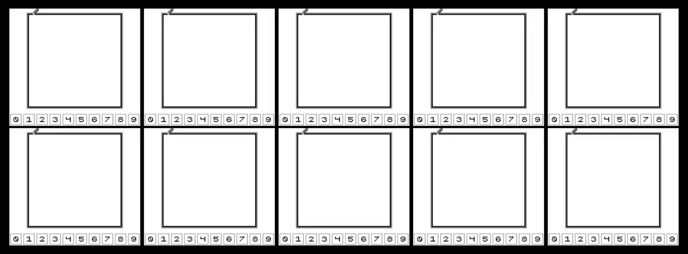

# Neural network handwritten digit recognition on a Game Boy

>A neural network? In _my_ Game Boy?
>
>It's more likely than you think.



This is a demonstration of neural network (NN) inference on a Game Boy.
First, a small NN is trained on a modified version of the [MNIST](https://en.wikipedia.org/wiki/MNIST_database) handwritten digit database.
The trained model is then [quantized](https://huggingface.co/docs/optimum/concept_guides/quantization) and saved into a Game Boy ROM.
This ROM also contains the inference code for the NN, implemented completely in assembly language.

When [run on the Game Boy](#evaluating-test-set-accuracy-on-the-game-boy), the ROM achieves **93.86%** accuracy on the 10,000-image MNIST test set.

## Usage

The ROM (`gb-nn.gb`) can be downloaded from the [Releases](https://github.com/jongoiko/gb-nn/releases/) page.

The pencil on the screen can be moved using the joypad keys.
To draw a pixel on the pencil's position, press the A key;
to erase, press the B key.
The drawing can be cleared by pressing the Select key.

To run the neural network to predict the drawn digit, press the Start key.
The screen will flicker while the prediction is running (for about 3 seconds), and then the predicted digit will be highlighted below the drawing area.

## Compilation

To build the ROM from scratch, it is first necessary to train and save the NN model.
The easiest way to do this is to `uv run train.py` in the `nn-training/` directory:

```shell
cd nn-training
uv run train.py
```

This way, [uv](https://docs.astral.sh/uv/) will make sure all dependencies are available before running the script.
After training is finished, a file called `model.bin` will be saved in `nn-training`,
which is necessary to compile the ROM.

To build the final ROM, make sure you have [RGBDS](https://rgbds.gbdev.io/) installed, and then run `make` from the project's directory.
The ROM will be saved in the newly-created `dist/` directory.

## How does it work?

For simplicity, the trained NN only consists of fully-connected layers using the ReLU activation function.
Out of the 60,000 images in the MNIST training set, 10,000 are used for validation and the other 50,000 for training.

When running inference using deep learning models, inputs, outputs and intermediate activations are typically stored as 32- or 64-bit floating point numbers.
However, the Game Boy's 8-bit CPU does not even have an integer multiplication instruction, let alone floating-point instructions.
Thus, the model's parameters and activations are quantized to 8-bit integers, so that we can do inference efficiently on an 8-bit CPU using only integer arithmetic.
This linear quantization scheme was proposed by Jacob _et al._ [1].
As an added benefit to inference speed, the trained model takes less space to store, which is important considering [we only have 16 KB of space in a ROM bank](https://gbdev.io/pandocs/Memory_Map.html).

The goal is to be able to classify digits drawn on screen.
The simplest way to do this is to have binary pixels;
thus, the MNIST dataset is preprocessed by [binarizing](https://en.wikipedia.org/wiki/Thresholding_(image_processing)) the pixel data.
A problem, however, is that the stroke width in MNIST is pretty thick, while the drawings to classify on the Game Boy have a 1-pixel stroke width.
To account for this and have the same 1-pixel stroke width for all images, the binarized digit drawings are [skeletonized](https://scikit-image.org/docs/0.25.x/auto_examples/edges/plot_skeleton.html) using Zhang's algorithm [2].
This preprocessing is applied to all images (both in the training and testing set).

### Evaluating test set accuracy on the Game Boy

Once we have trained a NN that obtains a sufficient validation accuracy, we would like to obtain a final performance estimate for the model by evaluating its accuracy on the test set.
Ideally, we would like to measure the accuracy of the model as it will be deployed, i.e. _running on the Game Boy itself_.

Since it is not feasible to manually draw and classify all 10,000 test set images on a Game Boy, this repository contains a Lua script for the [mGBA](https://mgba.io/) emulator that automates this process.
To run the script (`get_test_accuracy_mgba.lua`), the following two files need to be present:

- `dist/gb-nn.sym`, the ROM's symbol file;
- `nn-training/test_set.txt`, the preprocessed test set saved as a text file.

Both of these files will be generated by following the steps in the [Compilation](#compilation) section.
To evaluate test set accuracy on the Game Boy, start mGBA, load the ROM and execute the script.

---

[1] Jacob, Benoit, et al. "Quantization and training of neural networks for efficient integer-arithmetic-only inference." Proceedings of the IEEE conference on computer vision and pattern recognition. 2018.

[2] Zhang, Tongjie Y., and Ching Y. Suen. "A fast parallel algorithm for thinning digital patterns." Communications of the ACM 27.3 (1984): 236-239.
